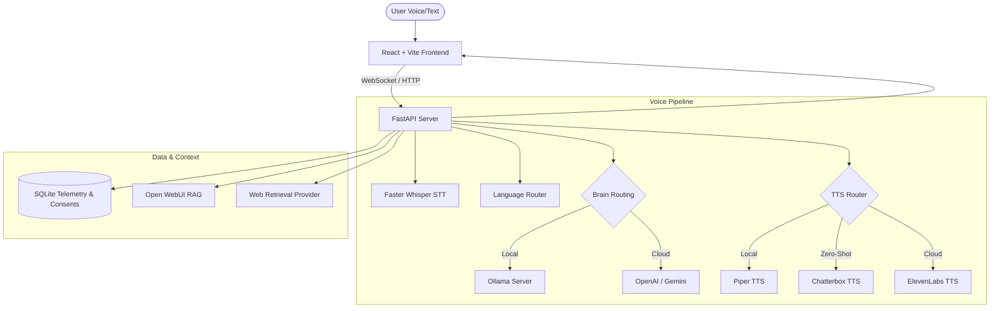

# SwarLocal (स्वरा लोकल)

SwarLocal is a local-first, low-latency voice AI assistant for macOS supporting both **Nepali and English** speech. Built with a FastAPI backend, a premium React/Vite/TypeScript frontend, and SQLite telemetry, SwarLocal operates fully offline to respect user privacy while providing modular hooks for cloud models, RAG (Retrieval-Augmented Generation), and web search.

---

## 🚀 Key Features

### 1. Hybrid Mixed-Language Routing
- **Dual-Language Speech Synthesis**: Sentence-level language routing splits inputs into Nepali and English fragments dynamically using Unicode heuristics and script checks.
- **Dynamic TTS Routing**: Directs English fragments to English models and Nepali fragments to Nepali models, ensuring clean pronunciation for code switching and loanwords.
- **Single-Model Fallback**: Option to synthesize all text with a single bilingual voice model if desired.

### 2. Multi-Engine Voice Pipeline
- **STT (Speech-to-Text)**: Local transcription powered by `Faster-Whisper` running on CPU or macOS MPS (Metal Performance Shaders).
- **LLM Reasoning**: Supports local Ollama engines (defaulting to `qwen2.5:7b` and `gemma3:4b` fallbacks) or cloud providers (OpenAI `gpt-4o-mini`, Google Gemini `gemini-1.5-flash`).
- **TTS (Text-to-Speech)**: Handles Piper local synthesis, Chatterbox local zero-shot voice cloning, and ElevenLabs cloud synthesis.

### 3. Voice Studio & Dataset Creator
- **Consent-First Design**: Requires explicit user consent, signature, and spoken recordings before voice dataset creation or model training.
- **Audio Processing & Quality Verification**: Denoising, loudness normalization, silence trimming, and speaker similarity validation are integrated.
- **Zero-Shot & Fine-Tuning**: Clones voices locally with Chatterbox or registers datasets for Piper model training.

### 4. Retrieval-Augmented Generation (RAG) & Web Search
- **Open WebUI Hook**: Synchronizes with a local Open WebUI RAG pipeline for custom document indexing.
- **Web Search Integration**: Auto-triggers DuckDuckGo web retrieval for temporal questions, appending real-time context and citation metadata.

### 5. Persistent Telemetry & Manual Evaluation
- **Database History**: All conversation turns, latencies (STT, LLM first-token, TTS generation, and total roundtrip ms), citations, and settings are written to a local SQLite database (`.local/swarlocal.db`).
- **Manual QA Panel**: Rate voice naturalness, pronunciation, and similarity to log model behavior in the database.

---

## 🛠 System Architecture



---

## 💻 macOS Installation & Setup

### Prerequisites
- **macOS** with Apple Silicon or Intel Core
- **Python 3.11** (recommended version)
- **Node.js 20+** and npm
- **ffmpeg** (required for audio conversions)
- **Ollama** (local LLM manager)

### 1. Install System Dependencies
```bash
brew install ffmpeg
```

### 2. Install and Start Ollama
Download and run the official app from [ollama.com](https://ollama.com) or install via terminal:
```bash
curl -fsSL https://ollama.com/install.sh | sh
```
Start Ollama and fetch the required reasoning models:
```bash
ollama pull qwen2.5:7b
ollama pull gemma3:4b
```

### 3. Clone and Initialize Project
Clone the repository and prepare your environment settings:
```bash
cp .env.example .env
make setup
```

### 4. Download Recommended Piper Voice Models
Run the setup download script to pull Nepalese and English Piper voices into your models cache:
```bash
make download-piper-voices
```
Your voices directory should look like this:
```text
models/
└── piper/
    ├── ne_NP-chitwan-medium.onnx
    ├── ne_NP-chitwan-medium.onnx.json
    ├── en_US-lessac-medium.onnx
    └── en_US-lessac-medium.onnx.json
```

### 5. Validate the Setup (Doctor Check)
Confirm all local dependencies, directories, and files are present and active:
```bash
make doctor
```

---

## 👨‍💻 Development Commands

SwarLocal uses a modular `Makefile` to handle development, testing, and formatting:

| Target Command | Description |
| :--- | :--- |
| `make dev` | Launches backend (Uvicorn: `8000`) and frontend (Vite: `5173`) in parallel |
| `make test` | Runs Python unit tests and verifies SQLite database operations |
| `make lint` | Performs backend syntax validation and typechecks the React code |
| `make doctor` | Diagnoses local models, directories, configurations, and API paths |
| `make e2e` | Runs an end-to-end local text-to-speech and logic smoke test |
| `make ui-test` | Runs static layout, theme contrast, responsive design, and UX contract tests |
| `make setup-voice-clone` | Installs system dependencies for local Chatterbox voice cloning |
| `make clean` | Wipes build targets, testing cache files, and coverage outputs |

---

## 🔌 API Documentation

SwarLocal exposes a FastAPI Swagger UI at `http://127.0.0.1:8000/docs`. Key routes are:

### Core & Settings
- `GET /health` - Checks backend lifecycle status.
- `GET /settings` / `POST /settings` - Retrieves or updates active configurations.
- `DELETE /local-data` - Cleans local temporary turn directories and clears SQLite logs.

### AI Reasoning & Providers
- `GET /ai-providers` - Lists Ollama, OpenAI, and Gemini brains.
- `POST /ai-providers/test/{provider}` - Validates API key and reports response latency.
- `POST /settings/ai-provider` - Saves API key credentials in encrypted runtime profiles.

### Chat & Voice Socket
- `POST /chat/test` - Performs a single-turn text-to-speech HTTP test.
- `GET /chat/history` - Returns persistent conversation turns with latencies, citations, and ratings.
- `POST /chat/turns/{turn_id}/rate` - Attaches manual Naturalness, Similarity, and Pronunciation ratings to a turn.
- `WS /ws/voice` - Real-time audio socket handling Push-To-Talk and streaming response.

### Voice Studio & Datasets
- `GET /voices` - Inspects details on all active Piper, cloud, and cloned custom voices.
- `POST /voices/create` - Initializes a new voice profile (Nepali, English, or Mixed).
- `POST /voices/{voice_id}/consent` - Uploads required signature and vocal consent file.
- `POST /voices/{voice_id}/recordings/{prompt_id}` - Uploads, cleans, and runs quality checks on vocal samples.
- `POST /voices/{voice_id}/clone` - Compiles recorded samples and builds model configurations.
- `POST /voices/{voice_id}/publish` - Publishes the voice to the global workspace selector.

---

## 🔒 Privacy & Boundaries

1. **Local-First Processing**: By default, no audio clips, speech transcripts, or reasoning loops leave your macOS machine. 
2. **Consent Requirement**: Model cloning requires an signed consent agreement. Voice profiles cannot be processed or finalized without verified signature credentials.
3. **No Voice Spoofing**: SwarLocal does not implement workflows for cloning third-party voices without consent. All training loops are built for user-owned datasets.
4. **Data Lifecycle**: Voice recordings, database metrics, and logs are cached under `.local/` (which is excluded from Git). You can clear all cached assets instantly in the settings tab.
