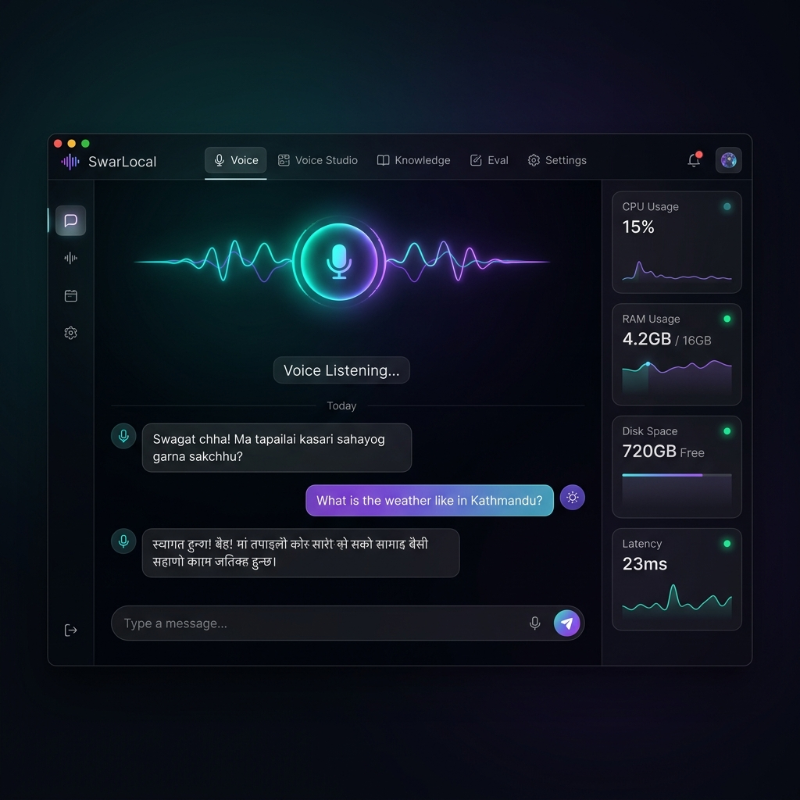
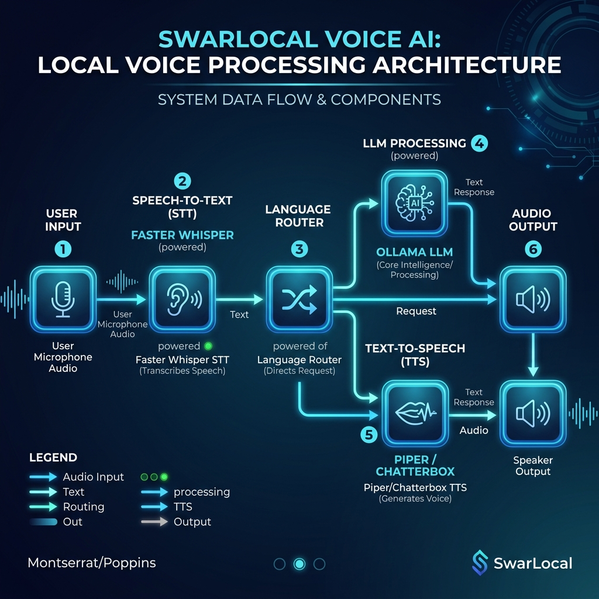
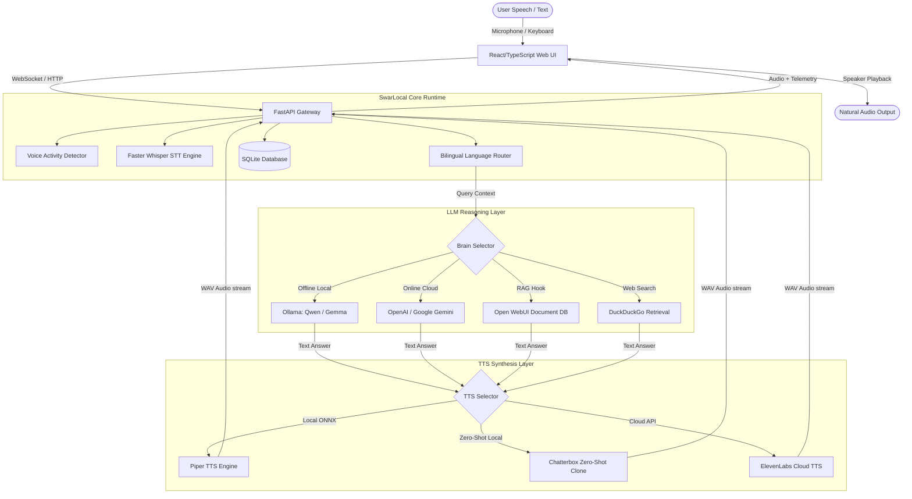

# SwarLocal (स्वरा लोकल)
### *The Local-First, Privacy-Preserving Voice AI Assistant for Nepali and English*

[](https://opensource.org/licenses/MIT)
[](https://www.apple.com/macos/)
[](https://www.python.org/)
[](https://www.typescriptlang.org/)



SwarLocal is a local-first, low-latency voice AI assistant designed for macOS that seamlessly integrates **Nepali and English** speech. By combining a high-performance FastAPI backend, a premium React/Vite/TypeScript frontend, and SQLite telemetry, SwarLocal runs fully offline on your Apple Silicon or Intel MacBook. 

Whether you are query-searching local files, archiving native dialects, or training consent-based voice models, SwarLocal puts you in absolute control of your data.

---

## 🌟 Executive Product Features

### 1. Hybrid Mixed-Language Routing (Heuristic Script Parsing)
SwarLocal is optimized for bilingual speakers who switch between Nepali and English in a single sentence:
* **Dynamic Sentence Chunking**: A custom Language Router scans incoming text, detects script boundaries (Devanagari vs. Latin), and splits sentences into localized chunks.
* **Smart TTS Routing**: English phrases are automatically synthesized using high-quality English voice artifacts, while Nepali terms route directly to native Devanagari voice engines, preventing broken pronunciations and garbled speech.
* **Bilingual Fallback**: Switch between separate specialized models or a single unified multilingual voice at the press of a toggle.

### 2. Multi-Engine Voice Pipeline
Built for off-grid operations but customizable with modern cloud APIs:
* **STT (Speech-to-Text)**: Local, high-performance transcription powered by `Faster-Whisper` using macOS MPS (Metal Performance Shaders) or CPU acceleration.
* **LLM Reasoning**: Modular routing defaults to local Ollama models (e.g., `qwen2.5:7b` for reasoning and `gemma3:4b` as a lightweight fallback). Secure hooks allow routing to cloud models (OpenAI `gpt-4o-mini`, Google Gemini `gemini-1.5-flash`).
* **TTS (Text-to-Speech)**: Local synthesis through Piper (`.onnx` exports), local zero-shot voice cloning with Chatterbox, and high-fidelity cloud voices via ElevenLabs.

### 3. Voice Studio & Quality Validation
A clean, consent-based environment for custom voice profiling:
* **Consent-First Architecture**: Strictly blocks voice model cloning until an explicit digital signature and a spoken recording verify ownership.
* **Real-time Quality Scoring**: Automatically scores audio samples based on peak amplitude, RMS noise floors, and silence boundaries.
* **Integrated DSP Cleanup**: Automatic background noise reduction, loudness normalization, and silence trimming using FFmpeg and local DSP libraries.

### 4. RAG (Retrieval-Augmented Generation) & Smart Web Search
* **Local Document Sync**: Connects directly to local Open WebUI databases to search through your PDFs, markdown notes, and personal documents.
* **DuckDuckGo Context Retrieval**: Auto-triggers search queries for temporal questions (e.g., *"What is the weather today in Kathmandu?"*), injecting citations and context directly into local prompts.

---

## 🛠 System Architecture & Data Flow





---

## 💡 Real-World Use Cases

### Use Case 1: The Privacy-First Executive Assistant
* **The Scenario**: A developer needs to consult sensitive codebase documents, personal journals, or financial spreadsheets hands-free during deep work.
* **How SwarLocal Solves It**: By running Ollama and Open WebUI entirely on-device, the assistant processes document lookups and reads answers aloud without uploading a single byte to the internet.

### Use Case 2: Dialect & Accent Preservation
* **The Scenario**: Linguists and speech researchers want to preserve specific Nepalese regional accents (such as Chitwan or Kathmandu valley dialects) and export clean datasets.
* **How SwarLocal Solves It**: Voice Studio provides a guided environment for recording native prompts, validating audio quality, normalising volume levels, and exporting structured, metadata-indexed `.zip` datasets for training.

### Use Case 3: Hands-Free Development & Dictation
* **The Scenario**: A developer wants to talk to their IDE, dictate comments in mixed Nepali/English, and hear build results while typing.
* **How SwarLocal Solves It**: WebSocket audio streams support low-latency Push-To-Talk and Auto-VAD. The assistant transcribes, reasons, and speaks back build statuses or code documentation with minimal latency.

---

## 📖 A Day in the Life of a SwarLocal Developer
> *Meet Aayush, a software developer building local automation tools in Lalitpur.*
>
> "Every morning, I launch SwarLocal on my MacBook Pro. Because I work with a mix of English codebases and Nepali team notes, standard voice assistants struggle to understand me. 
> 
> With SwarLocal, I ask: *'यो function को latency check गर र tell me what needs optimization.'* The system detects my language switch, queries my local RAG files for performance guidelines, and speaks back: *'तपाईंको function ले SQLite connection handle गर्दा wait time बढाएको छ.'* 
> 
> All of this happens completely offline, so my client's code remains completely secure on my machine. When I want to experiment with my own voice, I open **Voice Studio**, sign the consent form, record a few sentences, and immediately test a local zero-shot version of myself reading my markdown files."

---

## 💻 macOS Installation & Configuration

### Prerequisites
- **macOS** (Apple Silicon M1/M2/M3 or Intel Core)
- **Python 3.11** (required runtime)
- **Node.js 20+** and npm
- **ffmpeg** (essential for audio transcoding)
- **Ollama** (offline LLM backend)

### 1. Install System Dependencies
```bash
brew install ffmpeg
```

### 2. Download and Configure Ollama
Ensure Ollama is running, then pull the primary reasoning models:
```bash
curl -fsSL https://ollama.com/install.sh | sh
ollama pull qwen2.5:7b
ollama pull gemma3:4b
```

### 3. Initialize SwarLocal
Prepare your configuration profile and install environment packages:
```bash
# Copy settings template
cp .env.example .env

# Install backend python environment and frontend npm dependencies
make setup
```

### 4. Fetch Piper Voice Files
Download Nepalese and English Piper models to the cache directory:
```bash
make download-piper-voices
```
This prepares the following local layout:
```text
models/
└── piper/
    ├── ne_NP-chitwan-medium.onnx
    ├── ne_NP-chitwan-medium.onnx.json
    ├── en_US-lessac-medium.onnx
    └── en_US-lessac-medium.onnx.json
```

### 5. Run Local Diagnostics
Run the system doctor checks to verify files, configurations, and models:
```bash
make doctor
```
Once the doctor output reports **`READY`**, launch the development servers:
```bash
make dev
```
Open your browser and visit: `http://127.0.0.1:5173`

---

## 👨‍💻 Workspace Makefile Commands

SwarLocal utilizes a simple, structured `Makefile` for local automation:

| Command | Lifecycle Phase | Details |
| :--- | :--- | :--- |
| **`make dev`** | Development | Runs both FastAPI backend (`8000`) and Vite dev server (`5173`) in reload mode. |
| **`make test`** | Quality Assurance | Runs unittest suites validating routing, database entries, and audio helpers. |
| **`make lint`** | Code Standards | Compiles Python files and runs TypeScript type checking (`tsc --noEmit`). |
| **`make doctor`** | Diagnostics | Verifies local folders, configurations, and active Ollama/Whisper backends. |
| **`make e2e`** | Integration | Simulates audio turn pipeline end-to-end to ensure TTS/STT runtimes are healthy. |
| **`make ui-test`** | Frontend UX | Performs static checks validating dark-mode contrast, responsive elements, and accessibility controls. |
| **`make setup-voice-clone`**| Optional Feature | Installs requirements for Chatterbox local voice cloning. |
| **`make clean`** | Cleanup | Cleans output caches, coverage files, and compiled assets. |

---

## 🔌 API Developer Directory

SwarLocal features a FastAPI Swagger UI at `http://127.0.0.1:8000/docs`. Key developer endpoints are:

<details>
<summary><b>1. Core Settings & Telemetry</b></summary>

* `GET /health`: Health status.
* `GET /settings` / `POST /settings`: Handles application variables.
* `DELETE /local-data`: Clears temporary audio files and resets SQLite logs.
</details>

<details>
<summary><b>2. AI Reasoning Providers</b></summary>

* `GET /ai-providers`: Enumerates available reasoning brains.
* `POST /ai-providers/test/{provider}`: Evaluates latency for local or cloud credentials.
* `POST /settings/ai-provider`: Permanently writes API credentials to local config.
</details>

<details>
<summary><b>3. Real-Time Conversation</b></summary>

* `POST /chat/test`: Sends text and returns a synthesized WAV audio link.
* `GET /chat/history`: Returns persistent SQLite-backed conversation turns, timing statistics, and manual ratings.
* `POST /chat/turns/{turn_id}/rate`: Updates manual evaluations for naturalness, voice similarity, and pronunciation.
* `WS /ws/voice`: Streaming WebSocket handling real-time push-to-talk microphone audio.
</details>

<details>
<summary><b>4. Voice Studio & Datasets</b></summary>

* `GET /voices`: Returns active Piper, cloud, and cloned custom voices.
* `POST /voices/create`: Registers a new voice profile (Nepali, English, or Mixed).
* `POST /voices/{voice_id}/consent`: Saves text and spoken consent files.
* `POST /voices/{voice_id}/recordings/{prompt_id}`: Uploads a sample, runs DSP quality gates, and logs metadata.
* `POST /voices/{voice_id}/clone`: Compiles sample dataset and builds zero-shot models.
</details>

---

## 🤝 How to Contribute

We welcome contributions from open-source developers! Here is how you can help make SwarLocal better:

### Technical Contribution Pathways
1. **Audio Enhancement & DSP**: Improve the background noise reduction algorithm inside `noise_reduction.py` or loudness adjustments in `audio_enhancement.py`.
2. **Language Routing Optimization**: Tune unicode heuristics in `language_router.py` to better handle slang, emojis, or code-switched terms.
3. **Turn Detection (VAD)**: Enhance `turn_detector.py` to better ignore room noise, breathing, and background whispers.
4. **Model Integrations**: Add support for new local models like F5-TTS, OpenVoice, or local Whisper variants.

### Development Workflow
1. **Fork and Branch**: Create a feature branch from `main`.
2. **Implement & Test**: Write clear code with tests, then run quality checks:
   ```bash
   make lint
   make test
   make ui-test
   ```
3. **Commit & Push**: Follow professional git conventions (e.g. `feat: improve vad sensitivity`).
4. **Submit PR**: Describe the performance improvements, provide test logs, and link open issues.

---

## 🔒 Security & Data Guidelines

* **Local Sandboxing**: No transcripts, voice recordings, or reasoning logs leave your machine. The app runs offline by default.
* **Consent Verification**: Custom voice profiles cannot be cloned without verifying the signature and voice consent statements in SQLite.
* **Personal Data Protection**: Generated audio tracks, dataset exports, and SQLite logs reside inside the `.local/` directory (excluded from Git).
